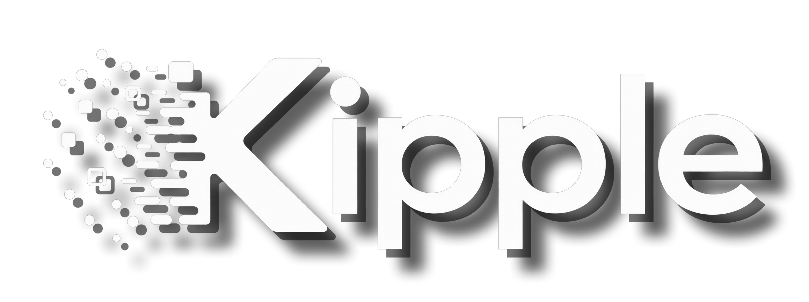

<p align="center">
  
</p>

<p align="center">
  <a href="https://img.shields.io/badge/status-phase%201%20%7C%20in%20progress-2ea44f?style=flat-square"></a>
  <a href="https://img.shields.io/badge/stack-TypeScript%20%7C%20Postgres%20%7C%20Docker-3178c6?style=flat-square"></a>
  <a href="https://img.shields.io/badge/email-native%20by%20default-9c51b6?style=flat-square"></a>
</p>

<p align="center">
  <strong>Open-source, self-hosted ticketing + client portal for MSPs.</strong><br/>
  Email-native conversations · REST + MCP API-first · white-label · one Docker Compose stack away
</p>

---


## What is Kipple?

Kipple is the help desk you run on **your** box for **your** clients.

One instance, your whole client base, your brand on everything. Clients open
and reply to tickets **over plain email** — no portal login required — while
your agents work tickets in a keyboard-first, console-style workspace with SLA
timers, time tracking that flows straight into invoicing, and an API surface
that AI agents can operate directly.

It exists to replace legacy PHP ticketing (hello, osTickets) with something
API-first, self-hostable, and unapologetically built for managed service
providers.

### Why the name?

*Kipple* is the term from the novel *The Joy of Shipping*: **neither trash
nor possessions — things that have future value.** A ticket in your queue is
exactly that: not done, not garbage, about to become useful. (The name is
settled. See §12 of the plan.)

## What it does

| | |
|---|---|
| **Email-native ticketing** | One support mailbox, plus-addressed ticket aliases (`support+1042@you.com`), IMAP IDLE ingest, smart thread matching, SMTP outbound (Microsoft 365 OAuth2 + Google Workspace providers in Phase 2). No subdomains, no catch-alls, works as-is on M365 and Google. |
| **API-first** | REST API generated from the same Zod schemas that validate requests — docs, validation, and MCP tools can never drift (OpenAPI 3.1 spec + scoped API keys are live; HMAC-signed webhooks land later in Phase 2). |
| **MCP server** | Your help desk that AI agents can operate: 7 core tools (tickets, clients, contacts, updates) over stdio or streamable HTTP, powered by scoped API keys — what a key can do is exactly what the REST API allows it. Writes are gated by key scope + the key creator's role. |
| **White-label everything** | Themes are pure token swaps, per-client branding overrides (theme, accent, logo), your logo on the portal. The agent app defaults to the "Console" theme: dark, monospace, keyboard-first, LED status lights. |
| **Time tracking** | Start/stop timers per ticket, billable flags, per client/agent rollups (CSV export + Invoice Ninja draft invoices in Phase 2/3). |
| **SLAs you can switch on** | Named policies, business-hours aware, per-ticket → per-client → instance-default precedence, escalation-ready. Off until you need it. |
| **Auth that doesn't hurt** | Passwordless magic links for clients (no passwords to track), TOTP MFA for staff, and OIDC + SAML SSO with one-screen presets (Entra, Google, Okta, Zoho, OneLogin, Duo, Huntress, Keycloak) + a people-mapping wizard that never re-points a user id (Phase 3). |
| **Notification streams** | One event pipeline, many channels: in-app + email live, Slack / Teams / Discord / Mattermost / web push in Phase 3 — with per-stream filters, quiet hours, and digests. |
| **Integrations** *(Phase 2/3)* | UniFi Talk contact sync, BookStack as your KB ("summarize & log" from a ticket), Tactical RMM deep links, monitoring alerts → tickets. |

## How the email story works

The hard part of ticketing, done properly:

```
 client hits "reply"                Kipple
 ┌──────────────────┐    IMAP IDLE   ┌───────────────────────────────────┐
 │ Gmail / Outlook  │ ─────────────▶ │ parse → dedupe (Message-ID)       │
 │ support+1042@…   │                │ → thread match (alias → subject   │
 └──────────────────┘                │   → contact) → one ticket, always │
      ▲                              └────────────────┬──────────────────┘
      │  threaded SMTP reply, agent as From,          │
      │  Reply-To back to the ticket alias            ▼
      └────────────────────────────────── agent workspace (console UI)
```

Internal notes never leave the system. No auto-responses are baked in —
every automated email is a template + rule *you* create. Nothing ships
enabled that wasn't asked for.

## Quick start

Production-style, on a single host (Postgres + Redis are the only external
services):

```sh
git clone <repo> && cd kipple/deploy
cp .env.example .env            # set AUTH_SECRET + PUBLIC_URL
docker compose up -d            # BYO proxy — point yours at api:3000
# or, on a host without a reverse proxy (bundled Caddy, auto-HTTPS):
docker compose -f docker-compose.proxy.yml up -d
```

First visit runs the setup wizard (instance name → owner account).
Migrations run automatically on boot. Done.

Development:

```sh
pnpm install
docker compose -f deploy/docker-compose.yml up -d db redis mailpit
pnpm dev                        # api + web + worker
```

## The stack

One language end-to-end — TypeScript strict everywhere, TypeScript nowhere
it doesn't belong.

```
 apps/api       Fastify 5 + Drizzle + Postgres 16 — REST v1, sessions, RBAC
 apps/worker    BullMQ on Redis — IMAP ingest, SLA ticks, webhooks, syncs
 apps/web       React 19 + Vite — agent workspace (Console theme) + client portal
 apps/mcp       MCP server (stdio + streamable HTTP) over scoped API keys
 packages/*     shared (Zod = source of truth) · ui (design tokens) · mail
```

## Rules we live by

- **Single-tenant by design.** One instance = one MSP = one database. No
  tenant column, no cross-MSP isolation layer. Scale to more MSPs by running
  more instances.
- **Client isolation is a query-layer rule**, not a UI trick. A contact can
  never surface another client's data — it's tested, not assumed.
- **No baked-in auto-replies.** All automated email is templates + rules,
  user-configured, off by default.
- **Stable identities.** SSO conversion only swaps the auth source; `users.id`
  never moves, so assignments and history survive.
- **Self-hosted to the bone.** Your uploads, your avatars, your secrets via
  env vars. Works fully offline behind any proxy.

## Roadmap

| Phase | What lands | Status |
|---|---|---|
| **0 — Foundations** | Monorepo, CI/CD + GHCR images, schema + auth (MFA, setup wizard, RBAC), setup/login/workspace screens | **done** |
| **1 — Core ticketing MVP** | Clients/contacts/tickets, email conversations, portal, SLAs, time tracking, themes, magic links, rules engine, attachments | **done** (all 18 rows) |
| **2 — API + MCP + integrations** | REST v1 (OpenAPI), webhooks, MCP server, M365 mail, UniFi Talk, BookStack, Tactical RMM | in progress (REST v1 + MCP live) |
| **3 — Power features** | Assets, reports, SSO (OIDC/SAML), notification streams, CSAT, osTickets importer | planned |
| **4 — Productization** | License decision, docs site, demo instance, Helm — deliberately last | deferred |

Exit criteria for every phase live in [docs/PLAN.md](docs/PLAN.md).

## Status

**Phase 1 complete — all 18 plan rows shipped.** Live today: the full
email ticket loop (IMAP IDLE ingest → thread matching → one ticket, threaded
SMTP replies, and zero automated emails unless you configure a rule), the
agent workspace (queue, ticket detail, reply/notes, status/priority/assign/
tags, live stats with sparklines, time tracking, SLA countdowns with a
superuser SLA manager, a clients + per-client portal branding manager), the
client portal with passwordless magic-link login and per-client branding
(theme, accent, logo), email templates + a rules engine with a "what would
fire" dry-run, the in-app notification center, per-agent presence, and file attachments on updates (v1: multipart uploads, local disk, client-scoped).
Hold states with auto-close, staff per-client access restriction, agent
invites, domain-gated client self-registration, and attachments v2 (chunked/
tus uploads + S3) all shipped — Phase 1 is complete (all 18 plan rows).

**Phase 2 row 1 is live:** the public REST API is open to scoped API keys
(`Bearer kip_...`; a key acts as its creating user, so full RBAC + client
scoping apply and a key never elevates), the OpenAPI 3.1 spec is served at
`/api/openapi.json` generated from the shared Zod schemas, and the MCP
server (7 tools over stdio + streamable HTTP) dogfoods the REST API with
the same keys. The rest of Phase 2 — M365 mail, webhooks, integrations —
is next.

Phase 0 (monorepo, CI/CD + GHCR images, schema + auth with TOTP MFA,
setup wizard, RBAC, theme system) is complete — see the rolling build state
in [docs/STATUS.md](docs/STATUS.md) for the full detail.

## More

- **Full plan & roadmap:** [docs/PLAN.md](docs/PLAN.md)
- **Contributing / agent instructions:** [AGENTS.md](AGENTS.md)
- **CI/CD:** `CI` runs lint + typecheck + tests on every push/PR; `Images`
  builds and pushes `ghcr.io/kulik-labs-development/kipple/{api,worker,mcp}`
  on `main` and `v*` tags — the Portainer stack pulls those.
